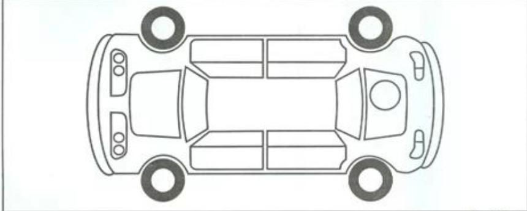

<!DOCTYPE html>
<html lang="ar" dir="rtl">
<head>
  <meta charset="utf-8" />
  <meta name="viewport" content="width=device-width,initial-scale=1" />
  <title>نموذج تسليم المركبة - تفاعلي</title>
  
  
</head>
<body>

  

    

      <h1>نموذج تسليم المركبة — تفاعلي</h1>

      

  
      

  <h1 style="margin:0;">نموذج تسليم المركبة</h1>

      <!-- STEP 1: بيانات المركبة الأساسية -->
      

        <label>1. نوع المركبة</label>
        <input type="text" id="carType" placeholder="مثال: باجيرو">
        <label>2. رقم اللوحة</label>
        <input type="text" id="plateNumber" placeholder="مثال: أ ب ج 1234">
        <label>3. الموديل</label>
        <input type="text" id="model" placeholder="مثال: 2024">
        <label>4. اللون</label>
        <input type="text" id="color" placeholder="مثال: أبيض">
        
اضغط التالي للمتابعة إلى حالة المركبة قبل الاستخدام.

      

      <!-- STEP 2: حالة السيارة قبل الاستخدام - عداد و صورة -->
      

        <label>حالة المركبة قبل الاستخدام — قراءة العداد</label>
        <input type="text" id="odoBefore" placeholder="مثال: 12500 كم">
        

        <label>تحديد أماكن الضرر (قبل الاستخدام)</label>
        

          

            
          

        

        
انقر لتحديد الضرر — انقر على العلامة لإزالتها

        <label style="margin-top:12px;">نسبة البنزين قبل الاستخدام (يمكن النقر على العداد أو اختيار)</label>
        

          

            
          

          <select id="fuelBeforeSelect" style="width:200px;">
            <option value="">اختر نسبة</option>
            <option value="فارغ">فارغ</option>
            <option value="ربع">ربع</option>
            <option value="نصف">نصف</option>
            <option value="ثلاثة أرباع">ثلاثة أرباع</option>
            <option value="ممتلئ">ممتلئ</option>
          </select>
        

      

      <!-- STEP 3: حالة السيارة بعد الاستخدام -->
      

        <label>حالة المركبة بعد الاستخدام — قراءة العداد</label>
        <input type="text" id="odoAfter" placeholder="مثال: 12800 كم">
        <label style="margin-top:10px;">تحديد أماكن الضرر (بعد الاستخدام)</label>
        

          

            
          

        

        
انقر لتحديد الضرر — انقر على العلامة لإزالتها

        <label style="margin-top:12px;">نسبة البنزين بعد الاستخدام</label>
        

          

            
          

          <select id="fuelAfterSelect" style="width:200px;">
            <option value="">اختر نسبة</option>
            <option value="فارغ">فارغ</option>
            <option value="ربع">ربع</option>
            <option value="نصف">نصف</option>
            <option value="ثلاثة أرباع">ثلاثة أرباع</option>
            <option value="ممتلئ">ممتلئ</option>
          </select>
        

      

      <!-- STEP 4: اسم المستلم + توقيع -->
      

        <label>اسم المستلم</label>
        <input type="text" id="receiverName" placeholder="اكتب اسم المستلم هنا">
        <label style="margin-top:10px;">التوقيع الإلكتروني (ارسم هنا)</label>
        <canvas id="signCanvas" width="760" height="140"></canvas>
        

          <button type="button" id="clearSignBtn" class="secondary">مسح</button>
          <button type="button" id="saveSignPreview" class="secondary">معاينة التوقيع</button>
        

      

      <!-- STEP 5: التاريخ والوقت + ملاحظات -->
      

        <label>تاريخ ووقت الاستلام</label>
        

          <input type="date" id="dateField" style="max-width:220px;">
          <input type="time" id="timeField" style="max-width:160px;">
        

        <label style="margin-top:12px;">ملاحظات إضافية (اختياري)</label>
        <input type="text" id="notes" placeholder="ملاحظات...">
      

      <!-- أزرار التنقل -->
      

        <button id="prevBtn" class="secondary" onclick="prevStep()" disabled>السابق</button>
        <button id="nextBtn" onclick="nextStep()">التالي</button>
      

    

    <!-- صفحة النتائج -->
    

      <!-- سيتم ملؤها ديناميكياً -->
    

  

<!-- Code injected by live-server -->

</body>
</html>
